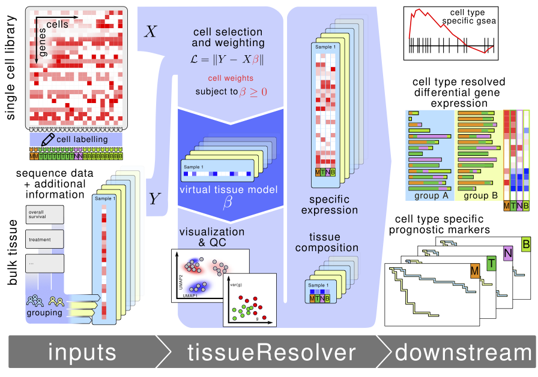

# tissueResolver
tissueResolver is a package for converting bulk RNA-seq datasets into virtual tissues using information from similar single cell datasets by assigning weights to true single cells, maintaining their molecular integrity. Virtual tissues can be analyzed in a similar way as conventional single cell datasets.

<div style="text-align: center">
    
</div>

For details, see [bioarxiv](https://www.biorxiv.org/content/10.1101/2023.11.15.567357v1)

## Installation
Use devtools to install the package:

``` R
library(devtools)
devtools::install_github("spang-lab/tissueResolver")
```

## Usage and Documentation
We provide a detailed [vignette reproducing the results of our paper](https://github.com/spang-lab/tissueResolver-docs).


## Citation
**Virtual Tissue Expression Analysis** by\
Jakob Simeth, Paul Hüttl, Marian Schön, Zahra Nozari, Michael Huttner, Tobias Schmidt, Michael Altenbuchinger, Rainer Spang, 2023.

For preprint see [bioarxiv](https://www.biorxiv.org/content/10.1101/2023.11.16.567357v1)
